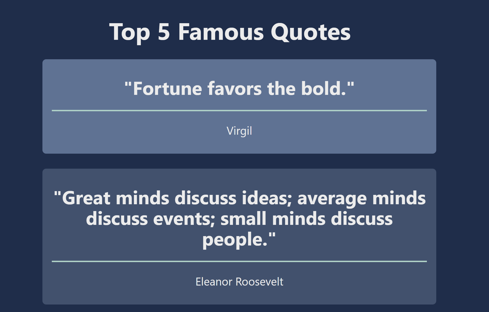

# Top 5 Quotes App

## Table of contents

- [Overview](#overview)
  - [Screenshot](#screenshot)
  - [Links](#links)
- [My process](#my-process)
  - [Built with](#built-with)
  - [Useful resources](#useful-resources)

## Overview

I sought to build a full stack application utilizing seperate docker images for the frontend, backend and database. Also to utilize kubernetes with Azure cloud offerings and tie it all together with github actions.

### Screenshot

### Links

Live Site URL: [AKS live app](http://172.200.224.235/)

## My process

- Frontend: Developed a responsive user interface using Vue.js and Nginx reverse proxy
- Backend: Created RESTful API with Azure Functions allowing seamless communication between front and backend
- Database: Designed a relational database schema using MySQL, ensuring efficient data storage and retrieval
- Infrastructure: Orchestrated and deployed the application to Azure Kubernetes Service via Github Actions utilizing Azure Container Registry and kubernetes manifests

### Built with

- Frontend: node and nginx containers
- Backend: Azure functions container
- Database: Mysql container

### Useful resources

- [Cheep kubernetes in Azure](https://trstringer.com/cheap-kubernetes-in-azure/)
